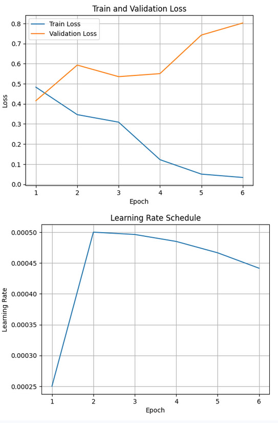
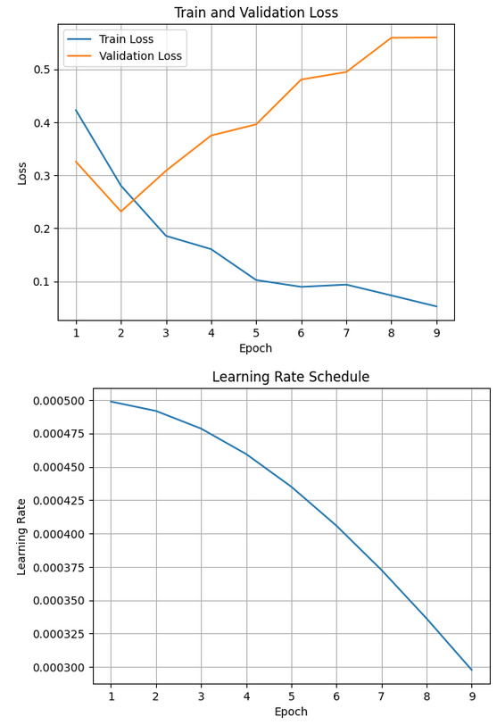

Reproducibility issues
===


### The problem
The model does not show any improvement in validation: despite using the JoLA parameters from the article, the training loss decreases and the validation loss increases, indicating overfitting or non-compliance of the training configuration with the conditions described in the original paper.

===
Here is the minimal changes made to reproduce results of use Llama-3.1-8b-Instruct on ARC-c dataset, as presented at example code.

#### Dataset
Commonsense Reasoning (ARC-c)
[Same Link](https://github.com/AGI-Edgerunners/LLM-Adapters/tree/main/dataset/ARC-Challenge)

Added data to repo [dataset/data_with_instruct/commonsense/ARC-c](https://github.com/LidaDavydova/jola-reproduction/tree/main/dataset/data_with_instruct/commonsense/ARC-c)

#### Other details

- For test I use 100 samles from test.json
- valid.json contains sample from test.json

Running commands:
```
cd examples

# for train
python run_jola.py

# for test
python eval_model.py
```

Files about train/test process:
[examples/outputs/llama-8b-arc-c](https://github.com/LidaDavydova/jola-reproduction/tree/main/examples/outputs/llama-8b-arc-c)

Yes, an early stopping was considered the best control point even after 1 epoch, but I tried several times to run train with different train_data_size (200-1000) and a different model such as llama-3b. And the training process usually ended after a maximum of 6 epochs.

lr=0.005

I use gate_scheduler: "expon" as most stable in the article, did not tried here experiments with lr or gate_scheduler.

### One more experiment, changed lr=0.0005 as it's in the article, other parameters are the same also.

Did not use EaryStopping now to track train/val more

1) with train_size = 200 and val_size = 200


2) with train_size = 1000 and val_size ~ 500


in text format:

* [examples/outputs/training_proc1.txt](https://github.com/LidaDavydova/jola-reproduction/tree/main/examples/outputs/training_proc1.txt)

* [examples/outputs/training_proc2.txt](https://github.com/LidaDavydova/jola-reproduction/tree/main/examples/outputs/training_proc2.txt)